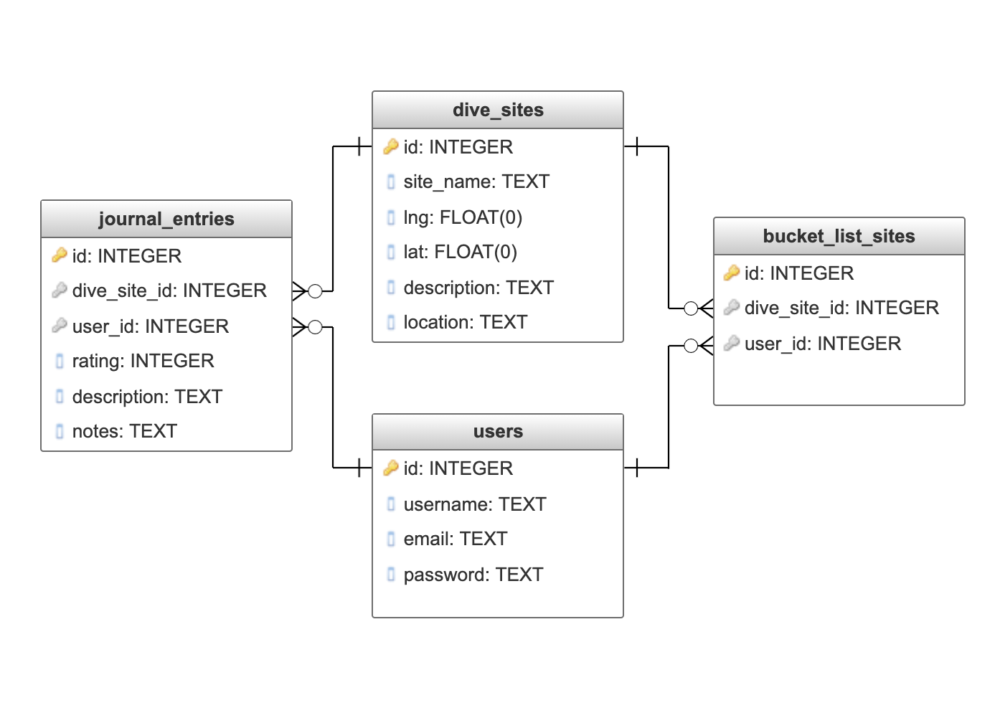

# Capstone Proposal

## Website Goal
The aim is for this site to be a place where users can discover new dive sites, share their experiences with others, and find inspiration for future dive trips. It will also serve as a place to keep a travel journal style record of the places they dive. 

## User Demographics 
The target demographic is recreational scuba divers.

## API Data
Data will be sourced from the divesites.com API and the mapbox API.
## Back End Outline

### Database Schema

### Languages / Frameworks
* Python
* PostgreSQL
* Flask

### Features / Endpoints
* `/` homepage where users can search for dive sites
* `/signup` GET: shows form POST: create an account
* `/login` GET: shows form POST: logs in user
* `/logout`* POST: logs out user
* `/user/edit`* GET: show edit form POST: update user info
* `/user/delete`* POST: delete user
* `/sites/search` POST: get list of dive sites from API 
* `/sites/<int:site_id>` GET: view additional details about a dive site
* `/bucket-list`*  GET: show bucket list POST: add dive site to their bucket list 
* `/bucket-list/delete`* POST: remove dive site from their bucket list 
* `/journal`* GET: show list of sites in journal
* `/journal/<int:site_id>`* GET: view details about dive site
* `/journal/<int:site_id>/add`* GET: show add form POST: add dive site to their dive journal 
* `/journal/<int:site_id>/edit`* GET: shows edit form POST: updates information about dive site 
* `/journal/<int:site_id>/delete`* POST: delete dive site 

(* user must be logged in to access endpoint)

### Sensitive Information
* passwords will be hashed with bcrypt
* users can only add/edit/delete their own dives 
* use session or JWT to keep track of authenticated user
* API keys need to be protected

## Front End Outline
### Languages / Frameworks
* JavaScript
* Ajax
* HTML
* CSS

### User Flows
#### All Users
* user types in the search bar or clicks a point on the map
* a list of dive sites is returned
* users can click on a dive site for more information
* user can click link in navbar for form to create an account

#### Registered Users
* click button in navbar to log in to their account
* search dive sites (search bar or click on map)
* click to view aditional information about a site
* click button to add a site to their bucket list or dive journal
* click link in navbar to view their bucket list and dive journal
* click button for form to edit notes about a dive site in their journal and give it a rating
* delete a dive site from journal or bucket list
* log out

## Aditional Details

### Features beyond simple CRUD
* interactive map to search dive sites

### Stretch goals / possible features
* a map of all the sites a user has dived
* a feed of recent reviews
* allow users to add photos

### Potential Issues with APIs
The divesite API has some entries with incomple information so I will need to work around that.

